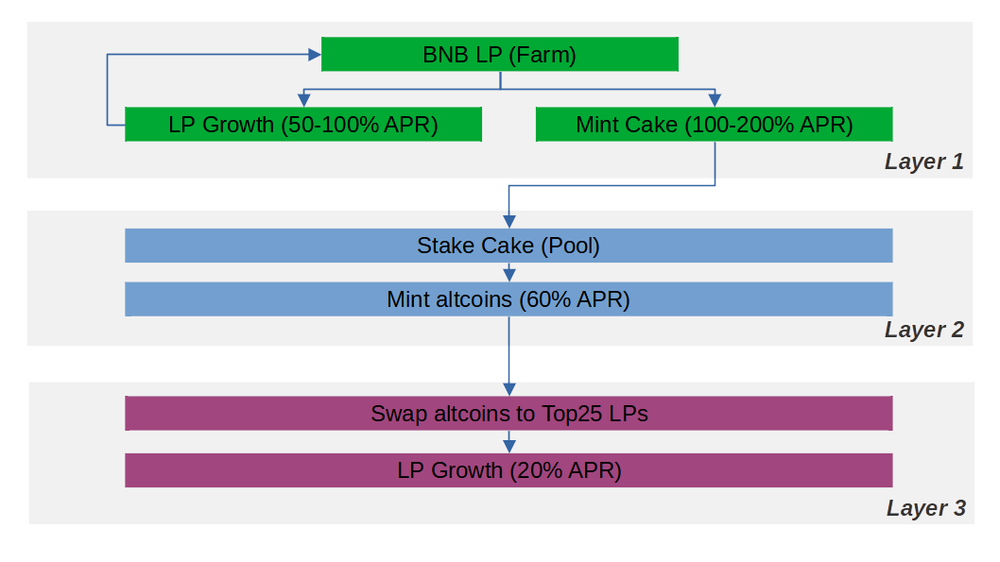

# PancakeSwap Auto Farmer ("Farmhand")
A layered and automated liquidity management system focused on DeFi risk management and diversification, specifically for the decentralised exchange (DEX) known as [PancakeSwap](https://pancakeswap.finance/). This project does **NOT** in any way guarantee to make you profit - use at your own risk!

## Strategy
The idea is that you place all of the initial capital into Layer 1, but each day it slowly trickles down into Layer 2 and then into Layer 3, meanwhile Layer 1 is also continually growing. You only gain underlying assets, without any trading.

## Layers
* **Layer 1 (Farm)**: Put your initial capital into a [farm](https://pancakeswap.finance/farms) offering a high yield.
* **Layer 2 (Staking)**: The CAKEs that you harvest from Layer 1 are automatically invested into a [pool](https://pancakeswap.finance/pools), which secures the capital in CAKE without any risk of impermanent loss or holding low-cap tokens.
* **Layer 3 (Long-Term LP)**: The yield from Layer 2 is automatically invested into long-term BNB liquidity holdings on less risky [farms](https://pancakeswap.finance/farms), such as BTC, ETH, ADA, LINK, XRP, DOGE, etc.

## Telegram Administration
Once you've populated the config file, administering Farmhand couldn't be easier. You interact with it using Telegram, with simple buttons for each action. It can generate graphs on-the-fly to show how your farm is performing, and keep you in the loop about how much your farm is worth.
